# HealthCopilot Model Report

## Summary Table

| Target | Metrics | SHAP Summary | SHAP Waterfall |
|--------|---------|--------------|----------------|
| aucGlucose | MAE=166.19, R2=0.99 | 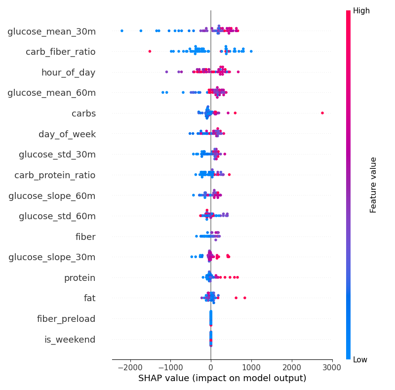 | 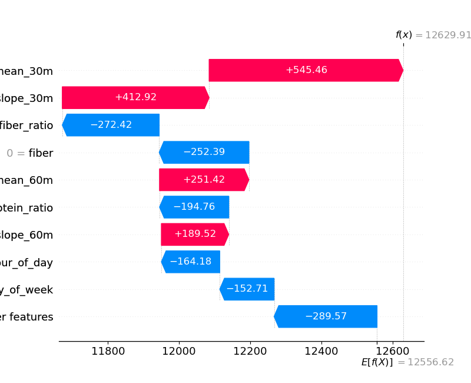 |
| deltaGlucose | MAE=0.91, R2=1.00 | 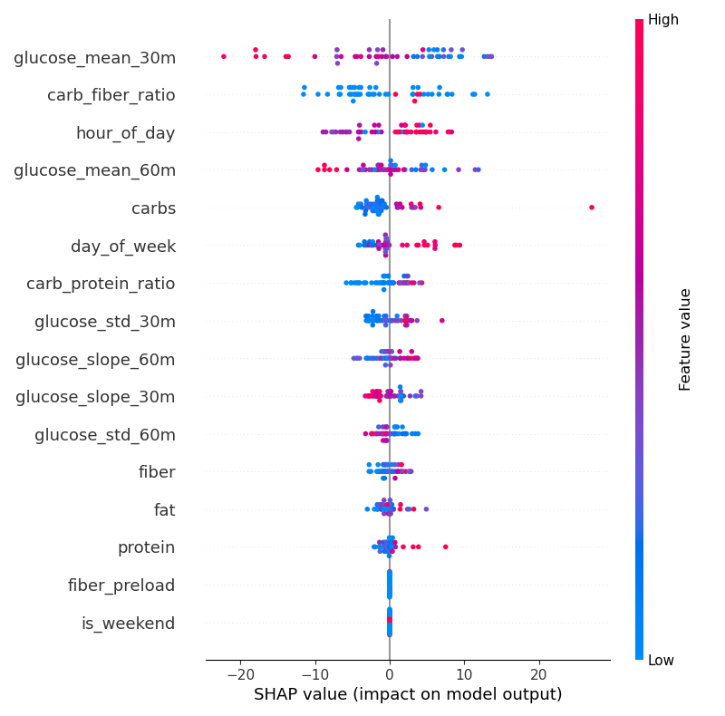 | 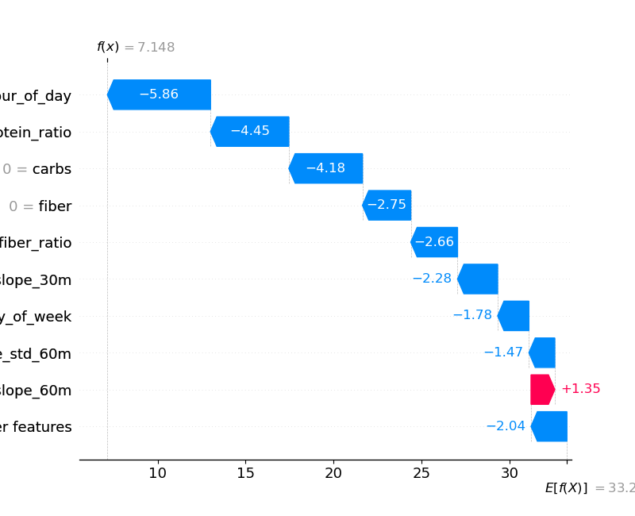 |
| spike | ACC=1.000, F1=1.000 | 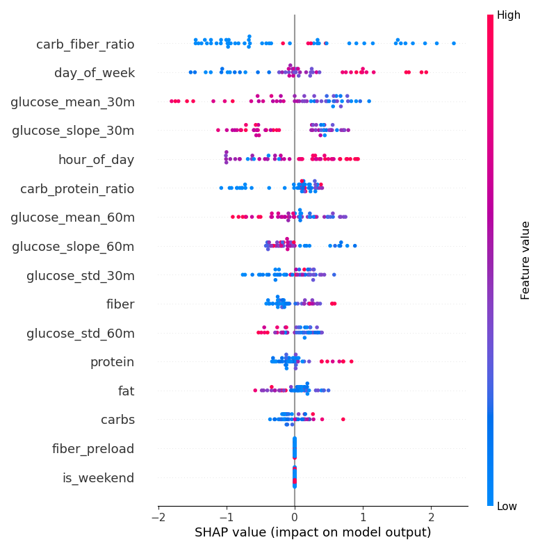 | 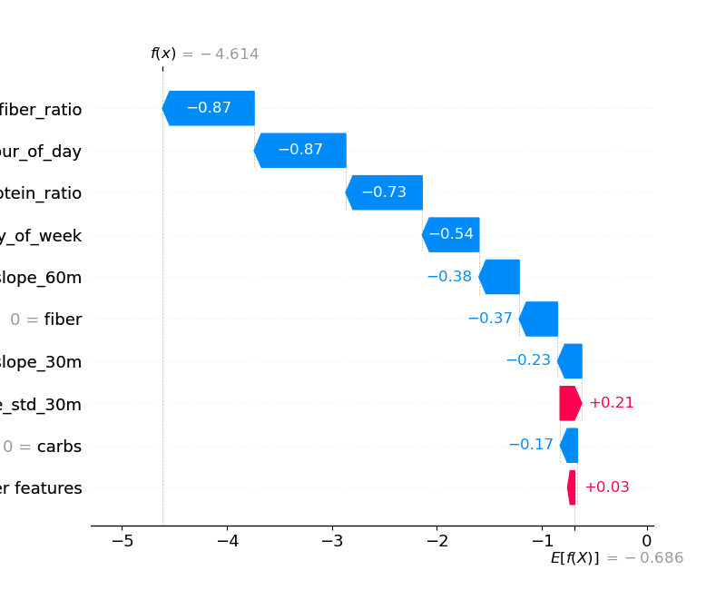 |
| timeToPeak | MAE=2.49, R2=0.99 | 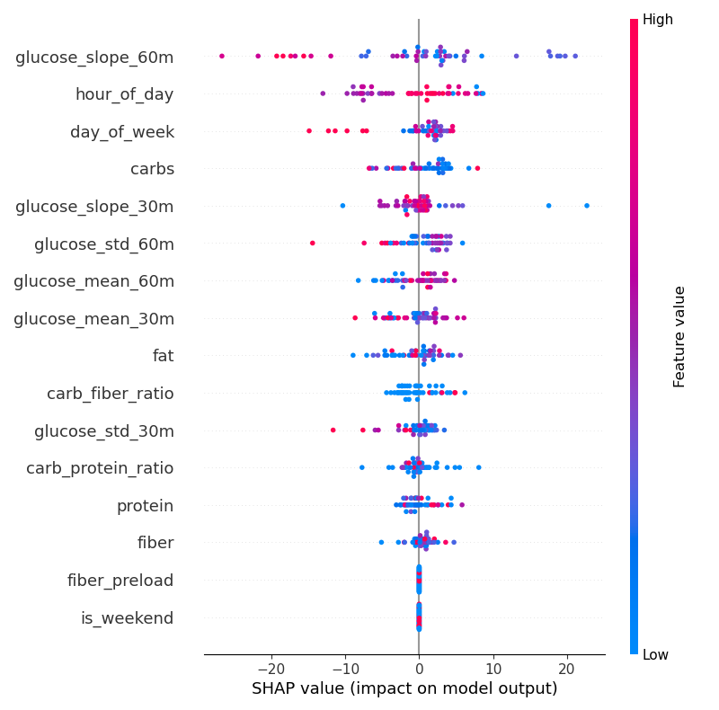 | 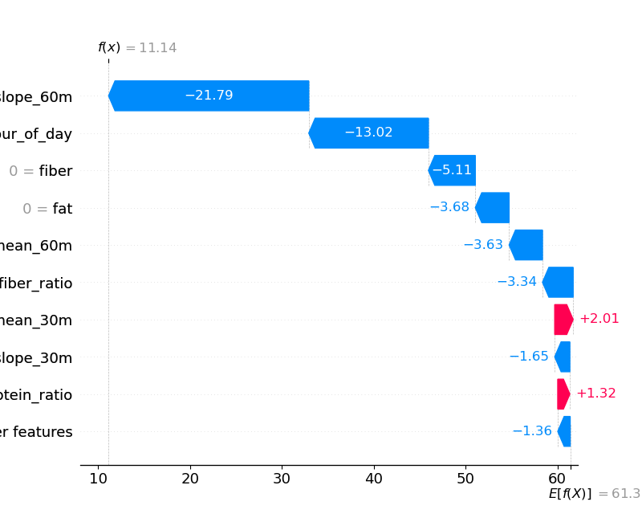 |
| durationAboveBaseline | MAE=1.82, R2=1.00 | 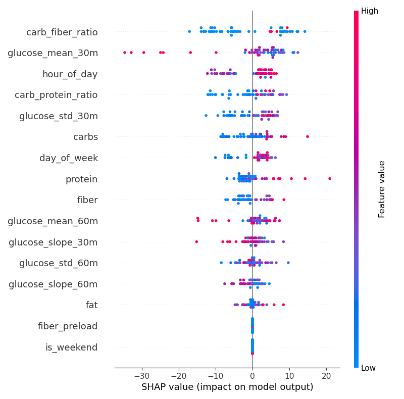 | 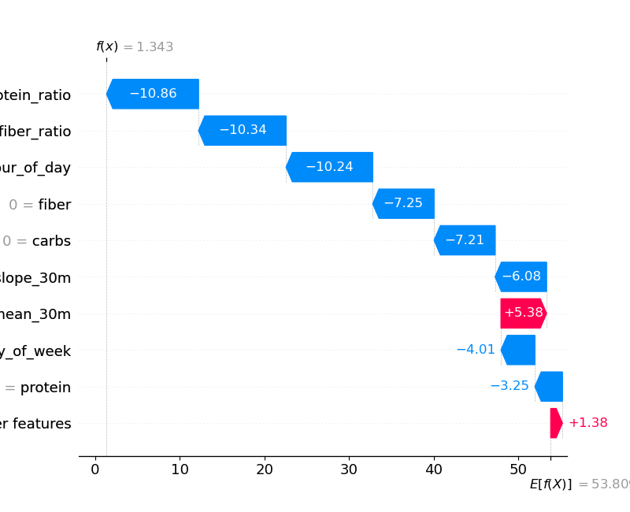 |
| timeToReturnBaseline | MAE=0.18, R2=1.00 | 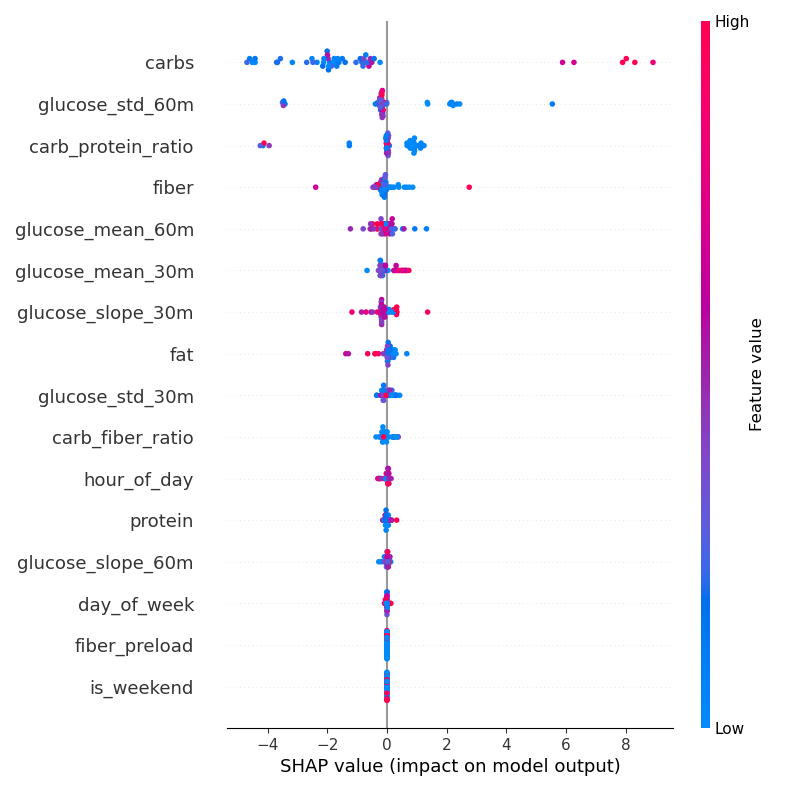 | 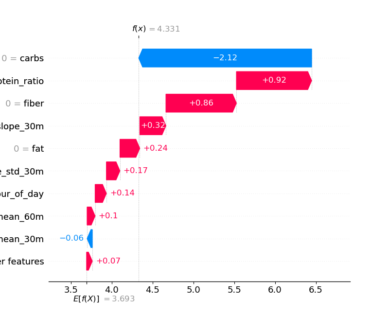 |
| numFluctuations | MAE=0.21, R2=1.00 | 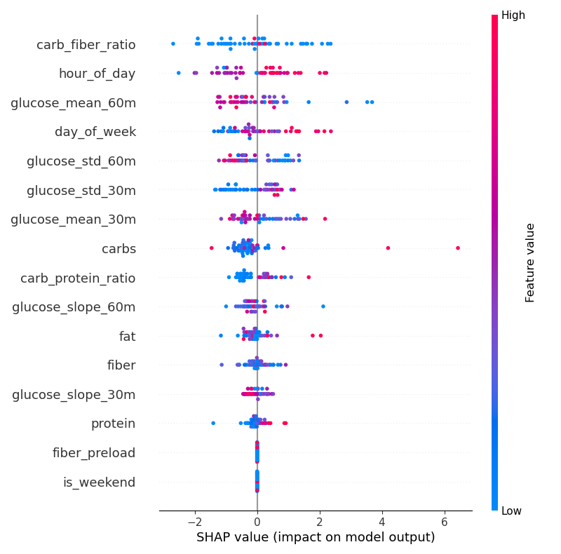 | 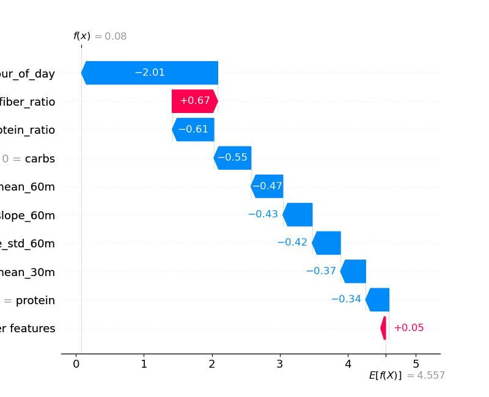 |
